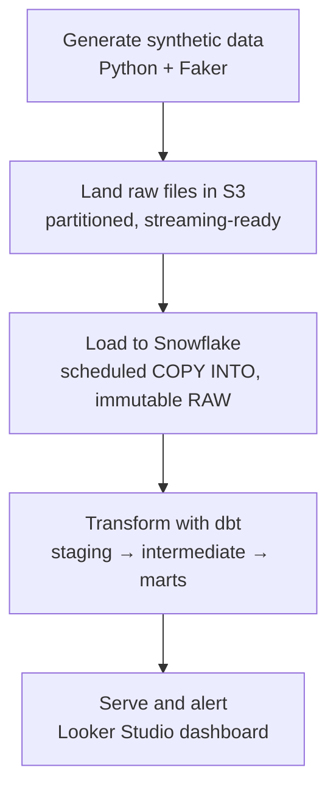

<p align="center">
  
</p>

<p align="center">
  <em>An end-to-end PIP claims analytics platform, built from scratch on synthetic data.</em>
</p>


🔗 **[Live Dashboard →](https://datastudio.google.com/reporting/c3ce75b3-dd2b-4a36-8bff-649c4ef0fa98)**
📐 **[Full Architecture Doc →](./ARCHITECTURE.md)**

---

## The business problem

In U.S. states with **PIP (Personal Injury Protection)** auto insurance, when someone is injured in a car accident, their *own* insurance carrier — not the other driver's — is responsible for paying for their medical treatment. A provider (chiropractor, physical therapist, orthopedic clinic, ambulance service) treats the patient and bills the carrier directly. That bill, and everything that happens around it, is a **claim**.

Carriers don't just pay bills automatically. They send letters back — requesting additional medical records, issuing partial denials, confirming payment, asking status questions — and **every letter carries a response deadline**. Miss it, and the provider (or the law firm/billing company representing them) can lose the right to collect payment, or has to escalate through a costlier appeals process.

Separately, carriers frequently require providers to complete **compliance training** — billing rules, documentation standards — before they'll process claims tied to that carrier at all. A provider who's fallen behind on required training can get claims stuck for reasons that have nothing to do with the patient's actual care.

**The real operational pain:** thousands of claims and letters moving through the system at once, and someone needs to catch the ones about to breach a deadline — or the providers falling behind on training — *before* it becomes a problem, not after a claim has already been denied or delayed. ClaimPulse is a working simulation of exactly that visibility layer, built on fully synthetic data so the pipeline and dashboard can be shared publicly without touching any real company's information.

---

## What it actually does

1. **Generates realistic, deliberately messy synthetic data** — claims, carrier letters, providers, carriers, and training records — with real-world data problems baked in on purpose: orphaned foreign keys, missing statuses, broken date pairs, duplicate provider records with typo'd names.
2. **Lands it in S3** in a partitioned, streaming-ready structure.
3. **Loads it into Snowflake**, immutable and untouched, via a scheduled `COPY INTO`.
4. **Transforms it with dbt** — staging (clean + flag), intermediate (apply business logic), marts (final, decided tables) — with 17 automated data-quality tests.
5. **Orchestrates the whole thing daily with Apache Airflow**, running in Docker.
6. **Serves it through a live, public Looker Studio dashboard** — an executive-style single page with a unified KPI strip and three drill-down sections.

---

## Architecture at a glance



The full design — data model (ERD), S3 layout, Snowflake account structure, dbt project layout, data-quality resolution strategy, orchestration, security/cost guardrails — is documented in detail in **[ARCHITECTURE.md](./ARCHITECTURE.md)**. This README focuses on the story and the outcome; the architecture doc is the engineering reference.

### The domain model

A claim links one provider and one carrier. A claim can have zero to several carrier letters, each with its own response deadline. A provider can have training records across multiple carriers. This project's dashboard exists specifically to answer two questions from that model: *which letters are breaching their deadline right now*, and *which providers have lapsed on required training* — see `ARCHITECTURE.md` section 2 for the full ERD.

---

## Tech stack

| Layer | Tool |
|---|---|
| Data generation | Python, Faker |
| Storage | AWS S3 (free tier) |
| Warehouse | Snowflake |
| Transformation | dbt Core (dbt_utils, dbt_expectations) |
| Orchestration | Apache Airflow (Docker Compose, LocalExecutor) |
| BI / Dashboard | Looker Studio |

Built entirely on free-tier infrastructure: AWS's 12-month free tier and Snowflake's 30-day/$400 trial credit, with explicit cost guardrails (warehouse auto-suspend, a resource monitor hard cap) documented in the architecture doc.

---

## Repository structure

```
claimpulse/
  README.md                    you are here
  ARCHITECTURE.md              full design doc and engineering reference
  data_generator/
    generate_data.py           synthetic data generator (reference vs. event data)
  snowflake/
    snowflake_setup.sql         databases, schemas, warehouse, roles, stage, raw tables
    load_to_snowflake.py        COPY INTO loader
  dbt/claimpulse/
    dbt_project.yml
    packages.yml
    models/staging/             5 models — clean, cast, flag
    models/intermediate/        3 models — business logic (SLA breach, training lapse)
    models/marts/               5 tables — 2 dimensions, 3 facts
    macros/
  airflow/
    Dockerfile
    docker-compose.yml
    dags/claimpulse_daily_pipeline.py
    scripts/
```

---

## The dbt layer, in brief

- **Staging** (5 models): casts types, standardizes formats, and *flags* problems without silently correcting them — a missing letter status becomes `'unclassified'` (never guessed), a duplicate provider record resolves to one canonical `resolved_provider_id`, a broken date pair gets an `is_date_anomaly` flag. Raw data itself is never modified.
- **Intermediate** (3 models): this is where flags become decisions — `int_carrier_letters_with_sla_flags` determines whether a letter is a live SLA breach (past due, unresolved, and not a broken-date anomaly); `int_provider_training_status` determines training lapse.
- **Marts** (5 tables): the final layer Looker Studio queries directly — `dim_carriers`, `dim_providers`, `fct_claims`, `fct_carrier_letters`, `fct_provider_training`.
- **17 automated tests**: `not_null`, `unique`, `relationships` (mostly `warn` severity — real-world inconsistencies get flagged for review, not treated as pipeline failures), plus a `dbt_expectations` check on broken date pairs at `error` severity, since that one is a genuine data defect, not a business judgment call.

---

## Real engineering problems hit and fixed

This project wasn't built without friction — and the friction is the point. A few of the more substantial issues, diagnosed and fixed along the way:

**Referential integrity vs. identity resolution.** Duplicate provider records (same person, typo'd name, different ID) get collapsed to one canonical ID for reporting. Early on, existence checks ("does this provider ID exist at all?") were mistakenly run against the *canonical* ID column instead of the *raw* one — since a duplicate's canonical ID isn't its own raw ID, this made real providers look like false orphans, inflating a true count of ~30 orphaned claims to 112, and separately causing a join fan-out that duplicated training records. Fixed by strictly keeping "does this exist" (checked against the full raw ID set) separate from "which entity does this collapse to" (the canonical ID, reserved for aggregation only).

**Reference data vs. event data.** The synthetic data generator originally used one fixed random seed for every table, for reproducible testing. Once the pipeline started running daily via Airflow, this meant every run regenerated byte-for-byte identical data — and since every S3 upload is (by design) uniquely named, Snowflake loaded each "new" identical file as genuinely new, silently multiplying every table on every run. The real fix was recognizing that carriers and providers are **reference data** (should be generated once, reused forever) while claims, letters, and training records are **event data** (should be genuinely new every run) — and rebuilding the generator around that distinction.

**A 725x row-count blowup, traced to stale S3 files.** A Looker Studio dashboard query suddenly returned tens of millions of rows where thousands were expected. Root cause: a day of active debugging had left many partially-failed pipeline runs' files stranded in S3, never successfully loaded. A later successful load swept up the *entire backlog* at once. Diagnosed with hard evidence — Snowflake's `information_schema.copy_history()` — rather than guesswork, confirming exactly which files loaded and when, and fixed by clearing the stale S3 prefix.

**Silent NULL audit columns.** `_loaded_at`/`_source_file` columns came back `NULL` after every load, despite having `DEFAULT` expressions defined. Traced to how Snowflake's `COPY INTO` with column-name matching handles columns absent from the source file — it inserts `NULL`, it does not fall back to a column's default. Fixed with an explicit transformation-based load that populates both columns directly.

Full detail on these and the schema-naming fix is in `ARCHITECTURE.md`.

---

## Running it yourself

1. **Generate data**: `python data_generator/generate_data.py`
2. **Set up Snowflake**: run `snowflake/snowflake_setup.sql` as `ACCOUNTADMIN`
3. **Load to Snowflake**: `python snowflake/load_to_snowflake.py` (needs `SNOWFLAKE_ACCOUNT`, `SNOWFLAKE_USER`, `SNOWFLAKE_PASSWORD` as environment variables)
4. **Run dbt**: `cd dbt/claimpulse && dbt deps && dbt build`
5. **Run the full pipeline on a schedule**: `cd airflow && docker compose up -d`, then trigger `claimpulse_daily_pipeline` from `http://localhost:8080`

---

## What's next

- GitHub Actions CI (Slim CI on pull requests against a dev schema)
- An automated alerting script — SLA breaches and training lapses posted directly to a Teams/Slack webhook, turning this from a dashboard into an automated business process
- Snowpipe as an event-driven alternative to the current scheduled `COPY INTO`
- A `STORAGE INTEGRATION` (IAM role-based) replacing the current credentials-based S3 stage

---

## Why this project exists

This was built as a hands-on learning project — every dbt model, every join, and every bug fix was written and debugged personally, using AI assistance as a design reviewer and rubber duck rather than a code generator. The goal wasn't a finished repo; it was actually understanding dbt, Snowflake, and cloud data engineering deeply enough to speak to real tradeoffs and real bugs in an interview — which is why the debugging stories above are documented as prominently as the finished architecture.