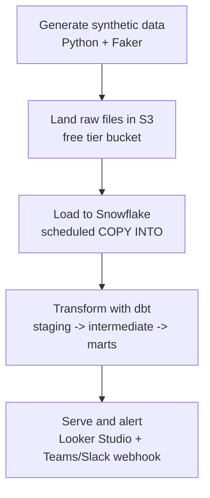

<p align="center">
  
</p>

<p align="center">
  <em>An end-to-end PIP claims analytics platform, built from scratch on synthetic data.</em>
</p>

<p align="center">
  <strong><a href="https://datastudio.google.com/reporting/c3ce75b3-dd2b-4a36-8bff-649c4ef0fa98">View the live dashboard →</a></strong>
</p>

---

ClaimPulse is a personal, end-to-end data engineering portfolio project simulating a PIP (Personal Injury Protection) insurance claims analytics platform. It's built entirely on synthetic data, on a free-tier-friendly stack (Snowflake trial + AWS free tier), and covers every major layer a data/analytics engineer is expected to know: data generation, cloud storage, a cloud data warehouse, transformation (dbt), orchestration (Airflow), and BI (Looker Studio).

It was built hands-on end to end — every dbt model, every SQL join, every fix, written by hand. AI was used as a Socratic reviewer and spec-writer along the way, not a code generator. The goal was to actually learn dbt and cloud data engineering deeply enough to speak to it confidently in an interview, not just to produce a repo that runs.

This README documents a working system honestly — including what's imperfect and what's intentionally deferred. For the full design rationale behind every decision below, see **[ARCHITECTURE.md](documentation/ARCHITECTURE.md)**.

## Table of contents

- [The business problem](#the-business-problem)
- [Live dashboard](#live-dashboard)
- [Architecture, layer by layer](#architecture-layer-by-layer)
- [Real engineering problems hit and fixed](#real-engineering-problems-hit-and-fixed)
- [Tech stack](#tech-stack)
- [Repo structure](#repo-structure)
- [What's not built yet](#whats-not-built-yet)

## The business problem

In PIP insurance claims, a provider (chiropractor, physical therapist, ambulance company, etc.) treats a patient and bills the patient's own auto insurance carrier directly. Carriers respond with letters — requests for more records, denials, payment confirmations — each carrying a response deadline. Missing that deadline can mean lost or delayed payment. Separately, carriers often require providers to complete compliance training before they'll process claims tied to that carrier; a provider who's lapsed on training can get claims stuck for reasons that have nothing to do with the actual medical care.

ClaimPulse surfaces the two things a claims manager needs visibility into daily:

- **Which carrier letters are breaching their SLA deadline**
- **Which providers have lapsed on required training**

— before either becomes a costly problem, not after.

## Live dashboard

**[datastudio.google.com/reporting/c3ce75b3-dd2b-4a36-8bff-649c4ef0fa98](https://datastudio.google.com/reporting/c3ce75b3-dd2b-4a36-8bff-649c4ef0fa98)**

Built in Looker Studio (Google's free BI tool) rather than Power BI specifically because it produces a publicly link-shareable dashboard with no viewer license required — the right tradeoff for a portfolio piece meant to be opened from GitHub or LinkedIn, not an internal company report.

One executive-style page: a banner with logo and title, a unified top KPI row (Total Claims, Total Letters, Total Trainings, Claim Breach Rate, Letter Overdue Rate, Training Lapse Rate) pulling from three separate underlying data sources, followed by three sections — **Claims Overview**, **SLA & Carrier Letters**, **Provider Training Compliance** — each with its own charts, a worklist table of the actual items needing attention, and its own filter/slicer controls scoped to the date field relevant to that section (`claim_open_date`, `received_date`, `assigned_date` respectively).

## Architecture, layer by layer



**Data generation** — [`data_generator/generate_data.py`](data_generator/generate_data.py), Python + Faker. Produces 5 synthetic tables — `carriers`, `providers`, `claims`, `carrier_letters`, `training_records` — matching a real claims domain model (a claim links one provider and one carrier; a claim can have 0-3 carrier letters; a provider can have training records across multiple carriers). Data is deliberately made messy on purpose: orphaned provider references, missing classification statuses, broken date pairs, typo'd duplicate provider records — so the dbt tests built later have real defects to catch, not trivial always-pass checks.

**Storage** — AWS S3, free tier. A streaming-ready layout (`raw/source=batch/table=<name>/year=/month=/day=/...`, Hive-style partitioning) designed so a future streaming source (e.g. Kinesis) could land data alongside the batch path without any restructuring. Event-table uploads are named with a UTC timestamp + short hash for idempotency; reference-table uploads (carriers/providers) use a fixed key instead, since they're meant to be overwritten, not accumulated (see [the reference-vs-event-data story below](#reference-data-vs-event-data-in-the-generator)). A `_manifests/` prefix records row counts and checksums per batch for fault-tolerant reconciliation; `_quarantine/` holds anything that fails structural validation before it ever reaches the good data path.

**Warehouse** — Snowflake, 30-day/$400 trial. A `RAW` database (immutable, string-typed landing ground, loaded via scheduled `COPY INTO`, not Snowpipe — a deliberate choice to keep Airflow as the single scheduler rather than running two schedulers side by side) and an `ANALYTICS` database with `staging`/`intermediate`/`marts` schemas. Least-privilege roles (`claimpulse_loader`, `claimpulse_transformer`), a single XS warehouse with aggressive auto-suspend, and a resource monitor hard-capped well under the trial credit limit.

**Transformation** — dbt Core.
- *Staging* (5 models, one per raw table): casts types, standardizes formats, and *flags* problems without silently fixing them — coalescing missing classification statuses to `'unclassified'`, flagging broken date pairs (`is_date_anomaly`), and resolving duplicate provider identities to a canonical `resolved_provider_id`.
- *Intermediate* (3 models): applies the actual business logic — `int_carrier_letters_with_sla_flags` decides whether a letter is a current SLA breach, `int_provider_training_status` decides training lapse/anomaly, `int_claims_enriched` joins claims to their letters' breach flags, ready for aggregation.
- *Marts* (5 tables — dims: `dim_carriers`, `dim_providers`; facts: `fct_claims`, `fct_carrier_letters`, `fct_provider_training`): the final, decided layer served to Looker Studio.
- 17 dbt tests total: `not_null`, `unique`, `relationships` (mostly `warn` severity — flagged for review, not treated as pipeline failures), plus one `dbt_expectations` custom test at `error` severity for the broken-date defect, since that's a genuine data quality issue rather than a business judgment call.

**Orchestration** — Apache Airflow, Docker Compose, LocalExecutor + Postgres. A daily DAG chaining generate → upload to S3 → load to Snowflake → `dbt run` → `dbt test`, with retries on the infrastructure-exposed steps and zero retries on `dbt test` — a failed data-quality test needs a human to look at the data, not a repeated attempt.

**BI** — Looker Studio, described above.

## Real engineering problems hit and fixed

These are the debugging stories worth reading — the pipeline mechanics were sound; the bugs came from real interactions between layers, and each was root-caused with evidence, not guesswork.

### Reference data vs. event data in the generator

The original generator applied one fixed seed to all 5 tables uniformly — deliberate at first, for reproducible early testing. Once the Airflow DAG began running repeatedly, this meant every run regenerated byte-for-byte identical rows for every table. Since S3 uploads are (by design) always uniquely named, Snowflake's `COPY INTO` saw a "new" filename every time and loaded each identical file as genuinely new data — silently multiplying every raw table on every run.

The real fix wasn't "remove the seed." It was recognizing that `carriers`/`providers` are **reference data** — a provider/carrier roster changes slowly in a real system — while `claims`/`carrier_letters`/`training_records` are **event data**, genuinely new things happening constantly. The generator was rewritten to seed-and-persist the former (generated once, reused every run) and generate-fresh the latter (no fixed seed, referencing the same stable ID pool every time), so the raw tables now behave the way their real-world counterparts actually do: a stable 10-row carrier roster and 208-row provider roster, alongside genuinely growing daily event data.

### The follow-on bug the fix introduced: the S3 uploader didn't know about the new reference-data shape

Fixing the generator wasn't the whole story. The S3 uploader had been written to assume every table was date-partitioned (`table=X/year=/month=/day=/...`), because that was true when every table was event data. Once `carriers`/`providers` moved to a single persisted, unpartitioned file, the uploader silently found zero matching partitions for them and stopped uploading them at all — a fix for one bug quietly introducing a second, opposite one (reference tables going stale instead of duplicating). Caught by tracing actual DAG run logs table by table rather than assuming the generator fix alone was sufficient, and fixed by teaching the uploader to route unpartitioned reference tables through their own path, using a **fixed S3 key** instead of a timestamp+hash filename — so Snowflake's existing load-history dedup can correctly recognize an unchanged file and skip it, rather than reloading the same 10/208 rows every day.

### A live production-style incident: stale S3 files causing a 725x row-count blowup

Discovered via Looker Studio suddenly returning tens of millions of rows on a join that should have produced thousands. Root-caused not to a code bug, but to operational debris: a day of active debugging had left many partially-failed pipeline runs' files stranded in S3, never successfully loaded (earlier attempts had failed before reaching the Snowflake load step). A later successful `COPY INTO` run swept up the entire backlog of never-before-loaded files at once, each contributing duplicate rows for the same underlying claims/letters.

Diagnosed using Snowflake's `information_schema.copy_history()` to directly inspect which files were loaded and when — confirming the theory with hard evidence instead of guesswork — and fixed by clearing the S3 prefix and re-running clean.

### `COPY INTO` silently nulling audit columns

`_loaded_at`/`_source_file` columns (each with a Snowflake `DEFAULT` expression) came back `NULL` after loading. Traced to `COPY INTO` with `MATCH_BY_COLUMN_NAME`: it inserts `NULL` for any target column absent from the source file — it does **not** fall back to that column's `DEFAULT`. Fixed by switching to an explicit transformation-based `COPY INTO` (`SELECT $1, $2, ..., CURRENT_TIMESTAMP(), METADATA$FILENAME FROM @stage (...)`), populating both audit columns explicitly.

### Referential integrity vs. identity resolution — hit twice, in two different models

Duplicate provider records (typo'd names, same person, different IDs) get resolved to one canonical `resolved_provider_id`. Early on, relationship tests and joins checking "does this provider exist" were mistakenly compared against the *canonical* ID column instead of the *raw* `provider_id` column — since a duplicate's canonical ID isn't its own raw ID, this made real (non-orphaned) claims and training records look like false orphans, inflating a true count of ~30 orphaned claims to 112, and causing a `unique` test failure on `training_records` from an unintended join fan-out.

Fixed by strictly separating the two concerns: **referential integrity** ("does this ID exist at all?") is checked against the full raw `provider_id` column, duplicates included; **identity resolution** ("which entity does this row actually belong to?") uses `resolved_provider_id`, reserved purely for grouping and aggregation downstream. Final verified counts: 27 date anomalies, 30 orphaned claims, 0 orphaned training records, 0 duplicate `training_id`s.

### Schema-naming double concatenation

dbt's default `generate_schema_name` behavior concatenates the profile's default schema with any model-level `+schema` config, producing a literal `staging_staging`-style schema name. Diagnosed, and selectively fixed for `intermediate`/`marts` via a custom macro override once separate schemas became a real day-to-day need — while leaving the (harmless, cosmetic-only) staging schema name as-is. A deliberate cost/benefit call, not a reflex to fix everything.

## Tech stack

| Layer | Tool | Free-tier note |
|---|---|---|
| Data generation | Python, Faker | n/a |
| Storage | AWS S3 | 5GB free, 12 months |
| Warehouse | Snowflake | 30-day trial, $400 credit |
| Transformation | dbt Core (dbt_utils, dbt_expectations) | free, open source |
| Orchestration | Apache Airflow (Docker Compose, LocalExecutor) | self-hosted, no cost |
| BI | Looker Studio | free, publicly shareable |

## Repo structure

```
claimpulse/
  README.md
  documentation/
    ARCHITECTURE.md        full design doc: ERD, pipeline flow, S3 layout,
                            data generation strategy, Snowflake structure,
                            dbt project structure, data quality resolution
                            table, orchestration, serving layer, tech stack
    snowflake_setup.md      databases, schemas, warehouse, roles, stage,
                            file format, raw tables
    logo.png
  data_generator/
    generate_data.py        the reference-vs-event-data generator
  airflow/
    Dockerfile               extends apache/airflow with boto3,
                              snowflake-connector, faker, dbt-snowflake
    docker-compose.yml       LocalExecutor + Postgres
    dags/                    the daily pipeline DAG
    scripts/
      upload_to_s3.py        S3 uploader (event + reference-table paths)
      upload_to_snowflake.py COPY INTO loader with audit-column fix
  dbt/claimpulse/
    dbt_project.yml
    packages.yml             dbt_utils, dbt_expectations
    models/
      staging/               5 models + schema.yml + tests
      intermediate/          3 models
      marts/                 5 tables (2 dims, 3 facts)
    macros/                  normalize_text.sql, generate_schema_name.sql
```

## What's not built yet

Documented as intentional next steps, not gaps that were missed:

- **GitHub Actions CI** — Slim CI (`dbt build --select state:modified+`) running on every PR against an isolated dev schema.
- **Automated alerting** — an SLA-breach / training-lapse check posting to a Teams or Slack webhook, turning this from a dashboard someone has to remember to check into an automated business process.
- **Snowpipe** — event-driven ingestion as an alternative to the current scheduled `COPY INTO`.
- **`STORAGE INTEGRATION`** — replacing the current credentials-based S3 stage with an IAM role + trust policy, so no secret is ever stored inside Snowflake.

---

This isn't a tutorial replica — it's a from-scratch build where every layer was reasoned through deliberately, real bugs were hit and root-caused with actual evidence, and cost/complexity tradeoffs were made and stated explicitly rather than defaulting to "do everything perfectly." No real company data was used at any point — synthetic generation only, end to end.
