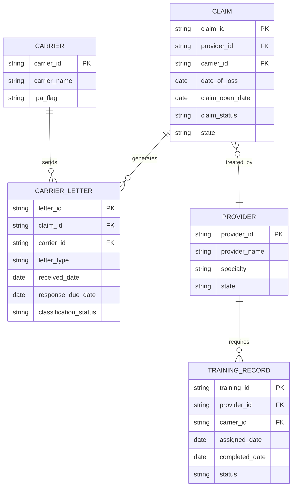
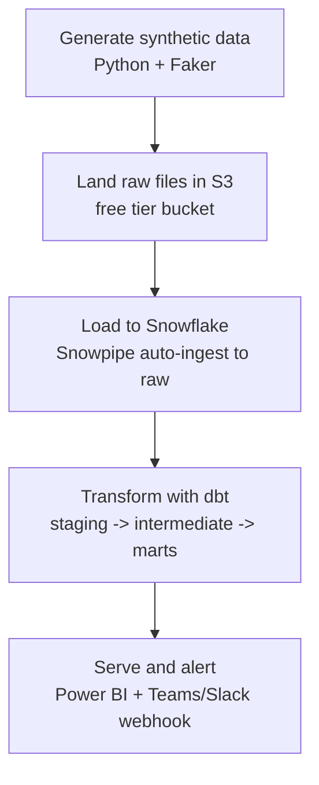
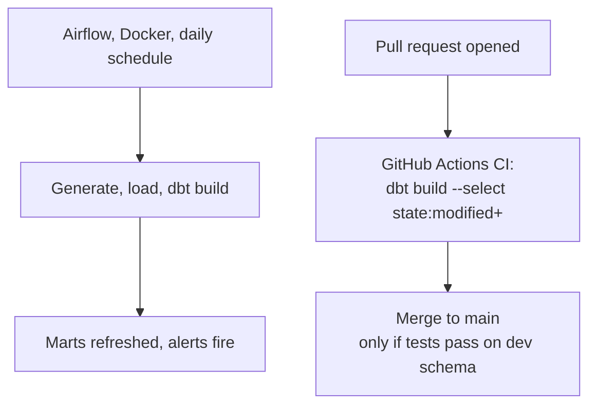

# ClaimPulse — Architecture

An end-to-end analytics platform that ingests, transforms, and monitors PIP/personal injury insurance claims data — modeled on real carrier-letter and provider-training workflows, built entirely on synthetic data on Snowflake + AWS free tier.

## 1. Business problem

PI/PIP claims stall when carrier response letters aren't processed on time or providers lapse on required training. Both cost law firms and TPAs money — missed statutory deadlines, compliance exposure, manual triage overhead. ClaimPulse ingests claim, carrier-letter, and provider-training data, models it, and surfaces **SLA breaches and training gaps before they become expensive**, with automated alerts instead of a dashboard someone has to remember to check.

## 2. Domain model (ERD)



**Business rules baked into the model:**
- A `CARRIER_LETTER.response_due_date` that's passed with `classification_status != 'resolved'` = an SLA breach.
- A `TRAINING_RECORD` with `assigned_date` older than 30 days and `status = 'pending'` = a training lapse.
- Both become flags in the marts layer, not just raw columns — the transformation layer's job is to compute these, not the BI tool.

## 3. Pipeline flow



## 4. S3 layout

Designed to hold today's batch loads and tomorrow's streaming source (e.g. Kinesis/Firehose) without any restructuring:

```
claimspulse-claim-processing/
  raw/
    source=batch/
      table=claims/
        year=2026/month=08/day=13/
          claims_20260813T143201Z_8f3a1c.csv
      table=carrier_letters/...
      table=providers/...
      table=carriers/...
      table=training_records/...
    source=streaming/                    <- reserved, empty until a streaming source exists
      table=claim_events/
        year=/month=/day=/hour=/
  _manifests/
    source=batch/table=claims/year=2026/month=08/day=13/
      manifest_20260813T143201Z.json
  _quarantine/
    table=claims/year=2026/month=08/day=13/
```

**Design decisions and why:**
- **`source=batch/` vs `source=streaming/`** — same table, same downstream Snowpipe target, different arrival pattern. A future streaming source (Kinesis Firehose) lands in its own prefix with its own partition granularity (down to `/hour=`); dbt staging models union both sources, so no rework is needed when streaming is added.
- **Hive-style partitioning** (`year=/month=/day=/`), not a flat date string — this is the convention Snowflake, Athena, and Spark all recognize natively for partition pruning, and it extends cleanly to `/hour=` for streaming.
- **Timestamp + short hash in every filename** (`<table>_<UTC timestamp>_<hash>.csv`) — makes every upload idempotent by construction. Re-running the uploader never overwrites a prior file, so a crashed mid-run script is always safe to re-run, and file-level lineage (exactly when a file landed) is preserved for debugging late claims.
- **`_manifests/`** — one JSON per upload batch recording every file's row count and md5 checksum. This is the fault-tolerance mechanism: if a Snowflake load fails partway, the manifest tells you exactly what should have arrived, so reconciliation doesn't rely on guesswork.
- **`_quarantine/`** — files that fail structural validation (wrong column set) before ever reaching `raw/`, so a malformed batch can't silently corrupt the good data path.
- **Retries**: the uploader uses botocore's adaptive retry mode (exponential backoff + jitter, aware of S3 throttling specifically) rather than a hand-rolled retry loop.
- **Scale**: boto3's `upload_file` automatically switches to multipart upload above 8MB per file — the same call already scales to multi-GB files with no code change, well beyond anything the free tier's 5GB will hold at this project's volume.

## 5. Snowflake account structure

- **RAW database** (`claimpulse_raw.raw_claims`) → loaded via scheduled `COPY INTO`, not Snowpipe (decision: keep a single scheduler — Airflow — rather than running Snowflake's own TASK scheduler alongside it; Snowpipe is a documented future upgrade once event-driven ingestion is needed). Every column is loaded as `STRING`, even dates — RAW does no casting or interpretation, that's staging's job (see section 7).
- **ANALYTICS database** (`claimpulse_analytics`) → three schemas built entirely by dbt: `staging`, `intermediate`, `marts`. **Note**: dbt's default behavior concatenates the profile's default schema with any model-level `+schema` config, which produced the literal schema `staging_staging` on the first build. Initially left as-is by choice (cosmetic only). Once separate `intermediate`/`marts` schemas became a real day-to-day need, a `generate_schema_name.sql` macro override was added — this makes any model-level `+schema` config authoritative on its own, with no concatenation. This fixes schema naming project-wide, not just for `intermediate`/`marts`: staging models (which have no `+schema` config) now correctly fall back to the plain profile default schema too. The old `staging_staging` schema is an orphaned leftover from before the macro existed and can be dropped (`DROP SCHEMA IF EXISTS claimpulse_analytics.staging_staging;`).
- **Warehouse**: `claimpulse_wh`, XS, `AUTO_SUSPEND = 60`, `AUTO_RESUME = TRUE`, `INITIALLY_SUSPENDED = TRUE`.
- **Resource monitor**: hard credit quota of 50 (well under the $400/30-day trial), notifies at 75%, suspends the warehouse outright at 100% — protects against a runaway query or a forgotten idle warehouse draining the trial early.
- **Roles**: `claimpulse_loader` (INSERT/SELECT on RAW only — used by the `COPY INTO` step) and `claimpulse_transformer` (SELECT on RAW, full control of ANALYTICS — used by dbt). Neither runs as `ACCOUNTADMIN`.
- **Stage**: credentials-based external stage pointing at `s3://claimspulse-claim-processing/raw/`, using the AWS access key/secret directly for now. **Documented upgrade path**: replace with a `STORAGE INTEGRATION` (IAM role + trust policy) once a role ARN is available — this avoids ever storing a secret inside Snowflake and is the production-grade pattern, deferred here the same way Snowpipe is.
- **Load semantics**: `COPY INTO` uses `ON_ERROR = 'CONTINUE'` (a malformed row doesn't abort the whole file — consistent with "never silently drop data" from section 7) and relies on Snowflake's built-in 64-day load history to make repeated runs idempotent — a file that already loaded successfully is automatically skipped on the next run, which is what makes the timer-based approach safe to fire on a schedule rather than being tightly coupled to exactly when new files land.

## 6. dbt project structure

```
models/
  staging/
    _sources.yml           raw table definitions
    _staging.yml            tests: not_null, unique, relationships, dbt_expectations
    stg_carriers.sql
    stg_providers.sql       resolves duplicate identities -> resolved_provider_id
    stg_claims.sql          casts dates, resolves provider match against full provider_id set
    stg_carrier_letters.sql coalesces null status, flags date anomalies
    stg_training_records.sql joins to stg_providers on raw provider_id for resolved_provider_id
  intermediate/
    int_carrier_letters_with_sla_flags.sql   letter-grain SLA breach logic
    int_provider_training_status.sql         training lapse + anomaly logic
    int_claims_enriched.sql                  claims + letter flags, pre-aggregation
  marts/
    dim_carriers.sql
    dim_providers.sql        one row per resolved_provider_id (dedup filter applied)
    fct_carrier_letters.sql  letter grain, joins in resolved_provider_id from stg_claims
    fct_provider_training.sql
    fct_claims.sql            claim grain, aggregated up from int_claims_enriched
  macros/
    normalize_text.sql       whitespace/casing normalization, used in dedup
```

**Naming correction:** the letters model was originally named `int_claims_with_sla_flags`, which was misleading — its actual grain is one row per *letter*, not per claim (a claim can have 0-3 letters). Renamed to `int_carrier_letters_with_sla_flags` to match its real grain. This was a spec mistake made early on, not a bug in the model itself — the logic was always correctly letter-grained.

**Column rename:** `stg_providers.canonical_provider_id` was renamed to `resolved_provider_id` partway through the build. This rippled into every model referencing it (`dim_providers`, the `_staging.yml` tests, `stg_claims`, `stg_training_records`) and required updating each one individually — a concrete lesson in why renaming a shared column is never a one-file change.

**Fifth mart added mid-build:** the original plan had 4 marts (`fct_claims`, `fct_carrier_letters`, `dim_provider`, `dim_carrier`). `fct_provider_training` was added once it became clear that training-lapse tracking is a genuinely separate business event from letter SLA tracking — different grain, different frequency — and folding it into `fct_carrier_letters` would have caused a fact-to-fact fan-out (duplicated rows) rather than a clean star-schema join through the shared provider dimension.

**Key modeling decision, learned by hitting it twice:** referential integrity checking and identity resolution are two separate concerns that must not be conflated.
- **Referential integrity** ("does this ID exist at all?") is tested against the full, raw `provider_id` column on `stg_providers` — every row, duplicates included.
- **Identity resolution** ("which resolved entity does this row actually belong to?") uses `resolved_provider_id` — collapsed across duplicates.

This bug was hit twice in the same build: first in `stg_claims` (relationship tests and the join both mistakenly pointed at the canonical/resolved column instead of the raw one, inflating orphan warnings from ~30 to 112), then again in `stg_training_records` after the `resolved_provider_id` column was added there — joining `source.provider_id = providers.resolved_provider_id` caused a fan-out (one training record matching multiple provider rows in a duplicate group), which surfaced as a failing `unique` test on `training_id`. Both times, the fix was the same: join/test against the raw `provider_id` column (guaranteed unique) for existence-checking, and reserve `resolved_provider_id` purely for later grouping/aggregation in intermediate and marts. Final verified counts: 27 date anomalies, 30 orphaned claims, 0 orphaned training records, 0 duplicate `training_id`s.

**`dbt run` vs `dbt test`:** `dbt build` treats an `error`-severity test failure as a hard stop for anything downstream in the dependency graph. Since the date-anomaly test on `stg_carrier_letters` is `error` severity and permanently fails on the same 27 synthetic rows every run, `dbt build` alone would perpetually skip `int_carrier_letters_with_sla_flags` and `fct_carrier_letters`. Resolved by splitting `dbt run` (builds every model regardless of test outcome) from `dbt test` (reports pass/warn/fail independently) — the pattern Airflow will use directly: run always builds the marts, test results decide whether to alert on data quality, without ever silently freezing part of the model layer.

## 7. Data quality resolution strategy

Raw data is never touched or corrected in place. Nothing is silently dropped, fixed, or overwritten between RAW and staging — an insurance/compliance-style pipeline needs to be able to prove what was wrong, not just show clean numbers at the end. Each layer has one job:

- **RAW** — exactly what came in from S3. Immutable, never modified.
- **staging** — casts types, standardizes formats, and *flags* problems (e.g. `provider_match_status`, `is_date_anomaly`). Does not decide what a flag means for the business.
- **intermediate** — applies the business logic that decides how a flagged row should behave (e.g. whether an unclassified letter counts as an SLA breach).
- **marts** — the final, decided version served to Power BI and the alerting script. Every row has a clear, defensible state by this point.

**Issue-by-issue resolution:**

| Issue | Caught where | Mechanism | Resolved how | Severity |
|---|---|---|---|---|
| Claim points to a `provider_id` that doesn't exist | `stg_claims` | dbt `relationships` test against `stg_providers.provider_id` (the full raw ID set — not `resolved_provider_id`, which only contains post-dedup identities) | Left join on raw `provider_id` keeps the claim, adds `provider_match_status = 'unmatched'` plus `resolved_provider_id = NULL`. Still tracked through `int_claims_enriched` into `fct_claims`. Never dropped — a broken provider link doesn't erase a real deadline. | warn |
| Letter missing `classification_status` | `stg_carrier_letters` | `not_null` test | Coalesced to `'unclassified'` (never guessed). Business rule in `int_carrier_letters_with_sla_flags`: unclassified is treated as **unresolved** — the conservative assumption. | warn |
| `response_due_date` before `received_date` | `stg_carrier_letters` | `dbt_expectations.expect_column_pair_values_A_to_be_greater_than_B` | Flagged `is_date_anomaly = true`, excluded from SLA breach calculation (can't compute a deadline breach off a broken deadline), but kept and surfaced on a data-quality mart page — never silently dropped. | error |
| Duplicate provider (typo'd name, different ID) | `stg_providers` | No automated test — fuzzy duplicates are a modeling problem, not a null/type problem | `WHERE provider_id = resolved_provider_id` filter (not a `GROUP BY`): `resolved_provider_id` is computed as `MIN(provider_id)` per `(normalized_name, state)` group, so the "winning" row is always the one row where the two columns are equal — filtering on that equality keeps exactly one row per real person. The one case where staging's output feeds a downstream dedup filter rather than just flagging a problem. | n/a (structural) |
| Training record referencing a duplicate provider's raw ID | `stg_training_records` | `unique` test on `training_id` (fails via fan-out, not directly) | Joining on `resolved_provider_id` instead of raw `provider_id` caused one training record to match multiple provider rows in a duplicate group, duplicating the training record itself. Fixed by joining `source.provider_id = providers.provider_id` (unique 1:1) and only then reading `providers.resolved_provider_id` for later grouping. | n/a (join bug, not a data-quality flag) |

**A downstream consequence worth tracking explicitly:** the 30 claims with `resolved_provider_id = NULL` will not appear in any `fct_claims` report that inner-joins to `dim_providers` for a provider-level breakdown — they'd simply be absent, with no visible indication anything is missing. `fct_claims` carries its own `has_provider_link` boolean (copied from `stg_claims.provider_match_status`) specifically so these 30 stay visible and filterable, rather than silently disappearing from provider-grouped views in Power BI.

**Severity and the pipeline:** `error`-level test failures block the Airflow DAG from promoting that run — bad dates are a real defect worth stopping for. `warn`-level failures (orphaned provider, unclassified letter) let the pipeline continue but get logged visibly, since a single unmatched provider shouldn't block a whole day's claims from loading.

## 8. Orchestration and CI/CD


- **Airflow** (local Docker Compose) owns the daily production run: generate → land in S3 → load to Snowflake → `dbt build`. This is what you demo/screenshot — avoids AWS MWAA, which isn't free tier.
- **GitHub Actions** owns CI: on every PR touching `models/`, run `dbt build --select state:modified+` against an isolated dev schema (Slim CI). Merge blocked until tests pass. This is the artifact that shows up as a green check in your GitHub PR history — good for the portfolio, and it's a real cost-control skill (rebuilding only what changed, not the whole DAG).

## 9. Serving layer

- **Power BI**: connects directly to the `marts` schema. Two report pages — claims/SLA overview (from `fct_claims` + `fct_carrier_letters`), provider training compliance (from `fct_provider_training`) — both joined to `dim_providers`/`dim_carriers` for names rather than raw IDs.
- **Alerting**: a scheduled step (GitHub Actions cron, or a task inside the Airflow DAG) queries `fct_claims` / `fct_carrier_letters` / `fct_provider_training` for new breaches and posts to a Teams or Slack webhook. This is the piece that turns the project from "a dashboard" into "an automated business process" — worth calling out explicitly in your README and LinkedIn post.

## 10. Security and cost guardrails

- No real company data, ever — synthetic generation only, documented as such in the README.
- Snowflake: least-privilege roles (see §5), resource monitor set on the warehouse with a hard credit cap so a runaway query can't burn the trial credit early.
- AWS: dedicated IAM user for this project (not root), scoped to the one S3 bucket, access keys stored as GitHub Actions secrets, never committed.
- Free tier tracking: note the 12-month AWS free tier limits (S3, Lambda if used) and the 30-day/$400 Snowflake trial clock in the README so anyone reviewing your repo sees you designed around real constraints, not infinite budget — that's a realistic engineering signal.

## 11. Repo structure

```
claimpulse/
  README.md
  ARCHITECTURE.md          (this file)
  data_generator/          Python + Faker synthetic data scripts
  airflow/                 DAG + docker-compose.yml
  dbt/                     full dbt project
  .github/workflows/       ci.yml (dbt build on PR)
  powerbi/                 .pbix file + exported screenshots
  alerts/                  SLA breach check script + webhook config
  docs/                    architecture diagrams, dbt docs site
```

## 12. Tech stack summary

| Layer | Tool | Free-tier note |
|---|---|---|
| Data generation | Python, Faker | n/a |
| Storage | AWS S3 | 5GB free, 12 months |
| Warehouse | Snowflake | 30-day trial, $400 credit |
| Transformation | dbt Core | free, open source |
| Orchestration | Airflow (Docker) | self-hosted, no cost |
| CI/CD | GitHub Actions | free for public repos |
| BI | Power BI Desktop | free |
| Alerting | Python + Teams/Slack webhook | free |

## 13. Build order

1. Data generator + domain model validation
2. S3 landing + IAM setup
3. Snowflake account, warehouse, roles, Snowpipe
4. dbt staging layer + first tests
5. dbt intermediate + marts + SLA/training logic
6. Airflow DAG wiring it all together
7. GitHub Actions CI
8. Power BI report
9. Alerting script
10. Docs, README, dbt docs site, demo GIF